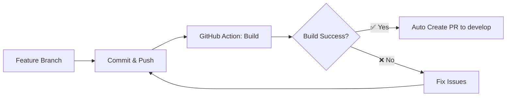
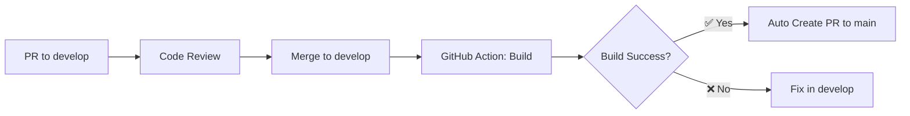
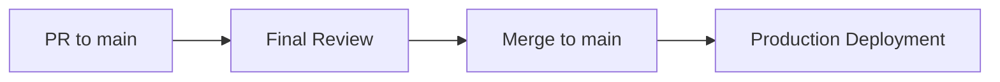

# CI/CD Pipeline e Proteção de Branches

Este documento descreve o pipeline de CI/CD implementado no projeto e as políticas de proteção de branches.

## 🔒 Políticas de Proteção

### Branches Protegidas
- **`main`**: Branch principal de produção
- **`develop`**: Branch de desenvolvimento e integração

### Regras Aplicadas
- ❌ **Commits diretos bloqueados** em `main` e `develop`
- ❌ **Exclusão de branches proibida** para `main` e `develop`
- ✅ **Pull Requests obrigatórios** com pelo menos 1 aprovação
- ✅ **Status checks obrigatórios** (build deve passar)
- ✅ **Branches devem estar atualizadas** antes do merge

## 🚀 Fluxo de CI/CD

### 1. Feature Development


### 2. Development Integration


### 3. Production Release


## 📋 GitHub Actions

### CI Workflow (`.github/workflows/ci.yml`)
**Disparado por:** Push em qualquer branch (exceto `main` e `develop`)

**Etapas:**
1. 🔧 Setup do ambiente (Node.js 20 + npm)
2. 📦 Instalação de dependências
3. 🔍 Execução do linting
4. 🏗️ Build da aplicação
5. 📤 Upload dos artefatos
6. 🔄 Criação automática de PR para `develop` (se build for bem-sucedido)

### Develop Workflow (`.github/workflows/develop.yml`)
**Disparado por:** Push na branch `develop`

**Etapas:**
1. 🔧 Setup do ambiente (Node.js 20 + npm)
2. 📦 Instalação de dependências
3. 🔍 Execução do linting
4. 🏗️ Build da aplicação
5. 📤 Upload dos artefatos (30 dias)
6. 🔄 Criação automática de PR para `main` (se build for bem-sucedido)

## 🛠️ Configuração Inicial

### 1. Criar branches necessárias
```bash
# Criar branch develop se não existir
git checkout -b develop
git push -u origin develop

# Criar branch main se não existir  
git checkout -b main
git push -u origin main
```

### 2. Configurar proteções (Automático)
```bash
# Dar permissão de execução ao script
chmod +x scripts/setup-branch-protection.sh

# Executar configuração
./scripts/setup-branch-protection.sh
```

### 3. Configurar proteções (Manual)
Siga as instruções em `.github/BRANCH_PROTECTION.md`

## 📝 Workflow de Desenvolvimento

### Para Features/Bugfixes
1. **Criar branch** a partir de `develop`:
   ```bash
   git checkout develop
   git pull origin develop
   git checkout -b feature/nova-funcionalidade
   ```

2. **Desenvolver e commitar**:
   ```bash
   git add .
   git commit -m "feat: adiciona nova funcionalidade"
   git push origin feature/nova-funcionalidade
   ```

3. **Aguardar processo automático**:
   - GitHub Action executa build
   - Se bem-sucedido, cria PR automático para `develop`
   - Revisar e aprovar o PR
   - Merge para `develop`

### Para Releases
1. **Build automático** em `develop` cria PR para `main`
2. **Revisar PR** para `main` (verificar changelog, versão, etc.)
3. **Aprovar e fazer merge** para `main`
4. **Deploy automático** (se configurado)

## 🔧 Scripts Disponíveis

### Build e Desenvolvimento
```bash
# Desenvolvimento local
npm run dev

# Build para produção
npm run build

# Linting
npm run lint

# Preview da build
npm run preview
```

### Configuração de Branches
```bash
# Configurar proteções automaticamente
./scripts/setup-branch-protection.sh
```

## 📊 Status Checks Requeridos

### Para merge em `develop`:
- ✅ `CI - Build and Auto PR / build-and-test`

### Para merge em `main`:
- ✅ `Develop CI - Build and PR to Main / build-and-test`

## 🚨 Troubleshooting

### PR automático não foi criado
1. Verificar se o build passou com sucesso
2. Verificar se já existe um PR aberto para a mesma branch
3. Verificar permissões do token GITHUB_TOKEN

### Proteção de branch não funcionando
1. Verificar se as branches existem no repositório
2. Re-executar script de configuração
3. Configurar manualmente via interface web do GitHub

### Build falhando
1. Verificar logs da GitHub Action
2. Testar build localmente: `npm run build`
3. Verificar dependências e versões do Node.js

## 📚 Recursos Adicionais

- [GitHub Branch Protection Rules](https://docs.github.com/en/repositories/configuring-branches-and-merges-in-your-repository/defining-the-mergeability-of-pull-requests/about-protected-branches)
- [GitHub Actions Documentation](https://docs.github.com/en/actions)
- [npm Documentation](https://docs.npmjs.com/)
